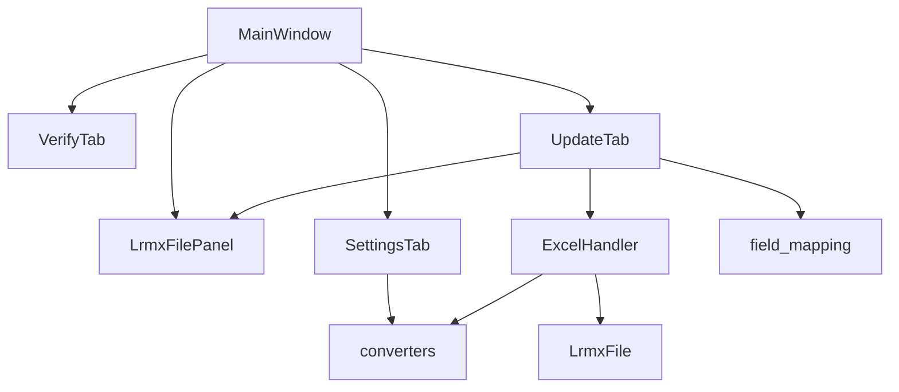

# LRMX → Excel 批量更新 设计文档

**日期:** 2026-06-25
**状态:** 已确认

---

## 1. 概述

在现有 **Excel → LRMX** 批量更新功能的基础上，新增反向的 **LRMX → Excel** 批量更新能力。同时将双向更新功能从 `verify_tab.py` 中拆分出来，形成独立的 `update_tab.py`，verify_tab 回归纯核验职责。

### 核心新增能力

- **LRMX → Excel**：从 LRMX 文件读取字段值，写入 Excel 名册对应单元格
- **转换器系统**：内置日期/正则/字典映射等预设转换器，支持用户编写 Python 代码自定义转换逻辑
- **新增 Excel 列**：LRMX 中有而 Excel 中没有的字段，自动追加到 Excel 末尾
- **SettingsTab 管理**：转换器在设置页统一管理，支持新建/编辑/删除/测试

---

## 2. 架构

### 2.1 文件结构

```
app/core/
├── excel_handler.py      ← 修改：新增 export_to_excel()
├── converters.py          ← 新建：转换器系统
├── lrmx.py                (不变)
└── compare_rules.py       (不变)

app/ui/
├── tabs/
│   ├── update_tab.py      ← 新建：双向批量更新 tab
│   ├── verify_tab.py      ← 修改：删除更新面板代码，回归纯核验
│   └── settings_tab.py    ← 修改：新增转换器管理区域
├── widgets/
│   ├── field_mapping.py   ← 修改：映射行增加转换器选择列
│   └── file_panel.py      (不变，共用)
└── main_window.py         ← 修改：注册 update_tab
```

### 2.2 组件依赖



---

## 3. 转换器系统 (`app/core/converters.py`)

### 3.1 统一接口

每个转换器实现以下函数：

```python
def convert(value: str) -> str:
    """接收原始值，返回转换后的值。转换失败应返回原值。"""
```

### 3.2 内置预设转换器

内置转换器硬编码在 `converters.py` 中，只读，不可删除：

| 名称 | 实现方式 | 示例 |
|------|----------|------|
| `日期: yyyyMM → yyyy.MM` | `datetime.strptime/strftime` | `202506` → `2025.06` |
| `日期: yyyyMMdd → yyyy.MM.dd` | `datetime.strptime/strftime` | `20250625` → `2025.06.25` |
| `日期: yyyy.MM → yyyyMM` | `datetime.strptime/strftime` | `2025.06` → `202506` |
| `日期: yyyy.MM.dd → yyyyMMdd` | `datetime.strptime/strftime` | `2025.06.25` → `20250625` |
| `正则: 去除空格` | `re.sub(r'\s+', '', value)` | `张 三` → `张三` |
| `字典: 性别(男女→12)` | `{'男':'1','女':'2'}.get(value, value)` | `男` → `1` |

### 3.3 用户自定义转换器

存储方式：`QSettings` group `converters`，key `custom`，JSON 数组格式：

```json
[
  {
    "name": "AI 性别推断",
    "code": "def convert(value: str) -> str:\n    ...",
    "created_at": "2026-06-25 14:30:00"
  }
]
```

执行方式（沙箱化）：

```python
def execute_user_converter(code: str, value: str) -> str:
    local_ns = {}
    exec(code, {'__builtins__': {}}, local_ns)
    convert_fn = local_ns.get('convert')
    if not callable(convert_fn):
        raise ValueError('代码中未定义 convert(value) 函数')
    result = convert_fn(value)
    return str(result)
```

安全措施：
- `__builtins__` 设为空字典，禁止 `import`、`open`、`eval` 等
- 执行包裹 try/except，失败返回原值并在日志中警告
- 转换器编辑 UI 提供测试输入框即时验证

### 3.4 API

```python
BUILTIN_CONVERTERS: list[dict]  # [{'name': ..., 'code': ...}, ...]

def load_custom_converters(settings: QSettings) -> list[dict]:
    """从 QSettings 加载用户自定义转换器"""

def save_custom_converters(settings: QSettings, converters: list[dict]) -> None:
    """保存用户自定义转换器到 QSettings"""

def get_all_converters(settings: QSettings) -> list[dict]:
    """获取所有转换器：内置 + 自定义，返回 [{'name': ..., 'code': ..., 'builtin': bool}]"""

def execute_converter(code: str, value: str) -> str:
    """执行转换器代码，返回转换结果。失败返回原值。"""
```

---

## 4. ExcelHandler 扩展 (`app/core/excel_handler.py`)

### 4.1 新增方法 `export_to_excel()`

```python
def export_to_excel(
    self,
    field_mapping: dict[str, str],       # lrmx字段名 → excel列名
    fields_to_write: list[str],           # 实际要写入excel的lrmx字段名
    converters: dict[str, str],           # lrmx字段名 → 转换器代码（仅需转换的字段）
    header_row: int = 1,
    match_excel_col_for_id: str | None = None,
    match_excel_col_for_name: str | None = None,
    progress_cb: Optional[Callable[[str], None]] = None,
) -> list[str]:
    """
    从 LRMX 文件读取数据，更新匹配的 Excel 行。

    field_mapping:           lrmx字段名 → excel列名
    fields_to_write:         实际要写入 Excel 的 lrmx 字段名
    converters:              lrmx字段名 → 转换器代码（不需要转换的字段不在此字典中）
    """
```

### 4.2 执行流程

```
1. 加载 Excel 工作簿
2. 读取表头行，构建 headers 列表
3. 构建 Excel 行索引（按键匹配）
4. 加载所有 LRMX 文件，构建 LRMX 索引
5. 收集新增字段：fields_to_write 中的字段如果在 Excel 表头中不存在，则追加到末尾
6. 遍历 LRMX 索引中的每个文件：
   a. 按匹配键查找 Excel 行
   b. 未找到 → 记录 "△ {姓名}  未在名册中找到匹配记录"
   c. 找到 → 逐字段读取 LRMX 值，应用转换器，写入 Excel 单元格
   d. 写入异常 → 记录 "✗ {姓名}  {错误信息}"
   e. 成功 → 记录 "✓ {姓名}  已更新 {N} 个字段"
7. 如果有新增字段，在 Excel 末尾追加新列
8. 保存 Excel（先备份 .xlsx.bak）
```

### 4.3 与现有 `update()` 的对比

| 维度 | `update()` (Excel→LRMX) | `export_to_excel()` (LRMX→Excel) |
|------|------------------------|----------------------------------|
| 映射方向 | excel列 → lrmx字段 | lrmx字段 → excel列 |
| 写入目标 | 单个 LRMX 文件 | Excel 单元格 |
| 备份对象 | 单个 `.lrmx.bak` | 整个 `.xlsx.bak` |
| 新增列 | 不适用 | 追加到 Excel 末尾 |
| 转换器 | 无 | 内联执行 |

---

## 5. UpdateTab UI (`app/ui/tabs/update_tab.py`)

### 5.1 整体布局

```
┌────────────────────────────────────────────────────┐
│  [Excel→LRMX]  [LRMX→Excel]       ← 方向切换按钮   │
├────────────────────────────────────────────────────┤
│  Excel 文件: [__________] [浏览]  表头行: [1▼]     │
│  匹配模式:   ○ 身份证  ○ 姓名  ○ 两者             │
│  匹配列:    身份证列 [____▼]    姓名列 [____▼]     │
├────────────────────────────────────────────────────┤
│  ┌─ 字段映射区 ─────────────────────────────────┐  │
│  │  LRMX字段        Excel列        转换器       │  │
│  │  ┌──────────┐  ┌──────────┐  ┌──────────┐   │  │
│  │  │ XingMing │→│ 姓名      │  │ 无转换  ▼ │   │  │
│  │  └──────────┘  └──────────┘  └──────────┘   │  │
│  │  [+ 添加映射]  [刷新字段]                     │  │
│  └──────────────────────────────────────────────┘  │
├────────────────────────────────────────────────────┤
│  [开始更新]                                         │
├────────────────────────────────────────────────────┤
│  ┌─ 更新日志 ───────────────────────────────────┐  │
│  │  ✓ 张三  已更新 3 个字段                      │  │
│  │  △ 李四  未在名册中找到匹配记录               │  │
│  │  ✗ 王五  错误: ...                            │  │
│  └──────────────────────────────────────────────┘  │
│  已更新 15 个  ·  未匹配 2 个  ·  失败 0 个         │
└────────────────────────────────────────────────────┘
```

### 5.2 方向切换

| UI 元素 | Excel→LRMX | LRMX→Excel |
|---------|-----------|-----------|
| 转换器列 | 隐藏 | 显示 |
| 新增字段 | 无 | 自动处理（追加到末尾，无需 UI 配置） |
| 其他 | 相同 | 相同 |

### 5.3 关键属性

```python
class UpdateTab(QWidget):
    USES_FILE_PANEL: bool = True

    def __init__(self, file_panel: LrmxFilePanel, parent=None):
        ...
```

- 通过 `LrmxFilePanel` 获取 LRMX 文件列表
- Excel 文件在 tab 内通过 `QFileDialog` 选择
- `busy_changed` 信号控制侧边面板和导航的启用状态

### 5.4 Worker

复用 `BaseWorker`（`app/ui/workers.py`），两个方向各一个 worker：

```python
class _ExportWorker(BaseWorker):  # LRMX→Excel
    def work(self):
        self._handler.export_to_excel(...)

class _ImportWorker(BaseWorker):  # Excel→LRMX (迁移现有逻辑)
    def work(self):
        self._handler.update(...)
```

---

## 6. SettingsTab 扩展

### 6.1 新增"转换器管理"区域

```
┌─ 转换器管理 ──────────────────────────────────────┐
│  ┌──────────────────────────┐  [新建] [删除]       │
│  │ 日期: yyyyMM→yyyy.MM  🔒 │                      │
│  │ 日期: yyyyMMdd→yyyy.MM.dd│                      │
│  │ 性别映射               ✏ │                      │
│  └──────────────────────────┘                      │
│  ┌─ 编辑 ───────────────────────────────────────┐  │
│  │  名称: [________________]                     │  │
│  │  代码:                                        │  │
│  │  ┌──────────────────────────────────────────┐ │  │
│  │  │ def convert(value: str) -> str:          │ │  │
│  │  │     return value                         │ │  │
│  │  └──────────────────────────────────────────┘ │  │
│  │  [测试: ____ → 结果: ____]                    │  │
│  └──────────────────────────────────────────────┘  │
└────────────────────────────────────────────────────┘
```

- 🔒 标记内置转换器（只读，不可编辑/删除）
- ✏ 标记自定义转换器（可编辑/删除）
- 列表选中后右侧显示编辑区
- 测试输入框即时验证转换结果

---

## 7. field_mapping widget 扩展

`_FieldRow` 新增第三列：转换器下拉框。

```python
class _FieldRow(QWidget):
    def __init__(self, tag: str, display: str, converters: list[dict], parent=None):
        # ... 现有代码 ...
        # 新增转换器 ComboBox
        self._converter_combo = QComboBox()
        self._converter_combo.addItem('无转换', None)
        for c in converters:
            self._converter_combo.addItem(c['name'], c['code'])
        layout.addWidget(self._converter_combo)
```

- 转换器列默认隐藏，仅在 LRMX→Excel 方向显示
- `_MappingWidget` 暴露方法控制列的可见性

---

## 8. verify_tab 清理

删除以下内容：
- `_UpdateWorker` 类（迁移到 `update_tab.py`）
- `_setup_panel` 中更新相关的 UI 组件
- `_update_*` 系列方法
- `_update_counts`、`_update_log_rows` 等状态变量

保留：
- 核验 Worker 和核验相关的 UI、状态
- `_DiffPanel`、`_ResultRow` 等核验结果展示组件

---

## 9. MainWindow 集成

```python
# main_window.py
from app.ui.tabs.update_tab import UpdateTab

# 在 _init_content 或导航切换中
update_tab = UpdateTab(self._file_panel)
update_tab.busy_changed.connect(lambda busy: self._file_panel.setEnabled(not busy))
```

---

## 10. 错误处理

| 场景 | 处理方式 |
|------|----------|
| Excel 文件不存在 | 弹出错误提示 |
| Excel 格式损坏 | 捕获异常，显示错误信息 |
| LRMX 文件解析失败 | 跳过该文件，记录警告日志 |
| 转换器执行异常 | 返回原值，日志警告，不中断流程 |
| 写入 Excel 异常 | 回滚备份，显示错误 |
| 用户代码有语法错误 | 转换器编辑时即时检测并提示 |

---

## 11. 文件变更清单

| 操作 | 文件 | 说明 |
|------|------|------|
| 新建 | `app/core/converters.py` | 转换器系统核心模块 |
| 新建 | `app/ui/tabs/update_tab.py` | 双向批量更新 tab |
| 修改 | `app/core/excel_handler.py` | 新增 `export_to_excel()` 方法 |
| 修改 | `app/ui/tabs/verify_tab.py` | 删除更新面板代码 |
| 修改 | `app/ui/tabs/settings_tab.py` | 新增转换器管理区域 |
| 修改 | `app/ui/widgets/field_mapping.py` | `_FieldRow` 支持转换器列 |
| 修改 | `app/ui/main_window.py` | 注册 update_tab |

---

## 12. 验收标准

1. **双向更新**：Excel→LRMX 和 LRMX→Excel 均能正常工作
2. **转换器**：内置转换器可直接选用，自定义转换器可新建/编辑/删除/测试
3. **新增列**：LRMX 有而 Excel 没有的字段，自动追加到末尾
4. **未匹配处理**：找不到匹配行时跳过并记录日志
5. **备份安全**：写入前自动备份，写入失败可恢复
6. **现有功能不受影响**：核验功能正常，Excel→LRMX 更新功能正常
7. **verify_tab 回归纯核验**：无更新相关代码残留
8. **测试**：`uv run pytest` 所有测试通过
